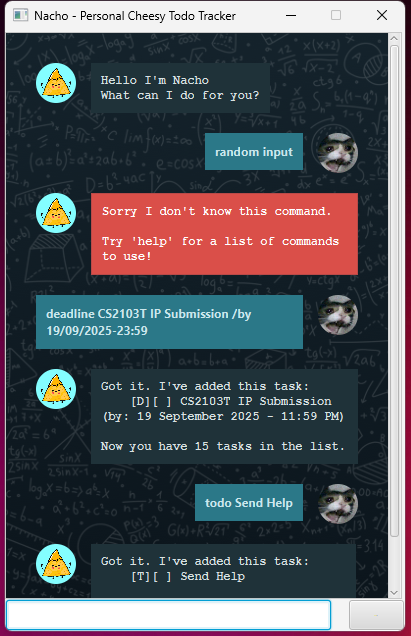

# Nacho User Guide


Say Hello to Nacho, your on the fly task management companion!

With Nacho, keeping track of your tasks is just a easy as grabbing a snack! 😜 (Guacamole not included)

---
## How to Run
Nacho supports 2 types of interactions
1. (Default) GUI
2. CLI 

GUI &rarr; Simply run the JAR file 

CLI &rarr; Run the file `Nacho.java` from 'src/main/java/nacho'

---

## Types of Supported Tasks 

| Task Type | Description                   |
|---------|-------------------------------|
|✅   Todo | Quick Task to note down       |
|⏲️  Deadline | Task with a specific due date |
|🗓️ Event   | Task with a Start and End     |

# Task Creation

> 🗒️
> - Words in <> are placeholder elements
> - Words in () are optional elements
> - Extraneous parameters for commands without parameters will be ignored

## Todo
Format: `todo <newTask>`

Example: `todo Eat lunch at the Terrace after CS2101 Presentations`

Output (CLI shown here):

```
    -----------------------------------
    Got it. I've added this task:
        [T][ ] Eat lunch at the Terrace after CS2101 Presentations
    
    Now you have 17 tasks in the list.
    -----------------------------------
```

## Deadline
Format: `deadline <newTask> /by <formatted_datetime>`
(formatted_datetime: `dd/MM/yyyy-HH:mm`)

Example: `deadline Submit IP Final Product /by 19/09/2025-23:59`

Output (CLI shown here):

```
    -----------------------------------
    Got it. I've added this task:
        [D][ ] Submit IP Final Product (by: 19 September 2025 - 11:59 PM)
    
    Now you have 18 tasks in the list.
    -----------------------------------
```
* Note that <formatted_datetime> will be parsed into a DateTime object subsequently


## Event
Format: `event <newTask> /from <Start> /to <End>`

Example: `event Recess Week! /from 22 Sept /to 28 Sept`

Output (CLI shown here):

```
    -----------------------------------
    Got it. I've added this task:
        [D][ ] Submit IP Final Product (by: 19 September 2025 - 11:59 PM)
    
    Now you have 18 tasks in the list.
    -----------------------------------
```
* Note that for Event Tasks <Start> and <End> are treated as Strings and not parsed into DateTime objects

---

# Features

## Help
Command to go for when the user needs a quick lookup on the usage of commands Nacho provides

Example: `help`

```
    -----------------------------------
    Available Commands: (Replace <> tags with your content
    list
    todo <task_header>
    deadline <task_header> /by <deadline_date>
    event <task_header> /from <start_date> /to <end_date>
    mark <task_number>
    unmark <task_number>
    find <keyword>
    sort
    delete <task_number>
    -----------------------------------
```

## list

Lists the tasks Nacho is currently storing for the user.

Example: `list` 

```
    -----------------------------------
    Here are the tasks in your list:
    1.[T][ ] Eat lunch at the Terrace after CS2101 Presentations
    2.[D][ ] Submit IP Final Product (by: 19 September 2025 - 11:59 PM)
    3.[E][ ] Recess Week! (from: 22 Sept to: 28 Sept)
    -----------------------------------
```

## Mark & Unmark
Checks Tasks as done or undone. Target task identified by its index number shown in list.

Example: `mark 1`
```
    -----------------------------------
    Nice! I've marked this task as done:
        [T][X] Eat lunch at the Terrace after CS2101 Presentations
    ----------------------------------- 
```
* Upon marking a task, the task will indicate it to be marked when calling `list`.

## Find by Keyword
Searches for tasks containing the keyword specified by the user and displays them as a list.

Format: `find <Keyword>`

Example: `find lunch`
```
    -----------------------------------
    Here are the matching tasks in your list:
    1.[T][X] Eat lunch at the Terrace after CS2101 Presentations
    ----------------------------------- 
```
- Note that <Keyword> *is* case sensitive 
- Substring matches are supported

## Delete
Sorts tasks in database in alphabetical order by task header.

Format: `sort`

Output:
```
    -----------------------------------
    Sorted!
    -----------------------------------
```
- Upon displaying this message, the database will remain sorted in order

## Delete
Deletes a task identified by its index number shown in list.

Format: `delete <task_number>`

Example: `delete 1`
```
    -----------------------------------
    Noted. I've removed this task:
        [T][X] Eat lunch at the Terrace after CS2101 Presentations
    
    Now you have 2 tasks in the list.
    ----------------------------------- 
```

## Bye
Closes the program after a set timeout.

Format: `bye`

```
    -----------------------------------
    Bye. Hope to see you again soon!
    (Closing in 3 seconds)
    ----------------------------------- 
```